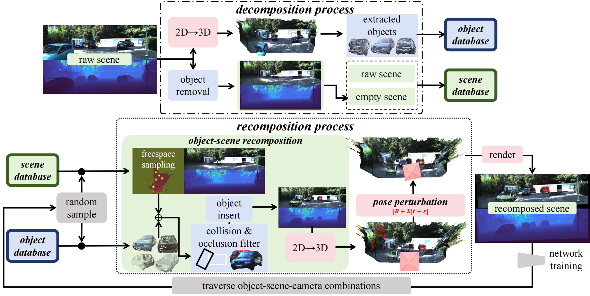

# Object-Scene-Camera Decomposition and Recomposition for Data-Efficient Monocular 3D Detection



## Quick Start

### Environment
Core packages in our environment:
```bash
python=3.8.5

numpy                         1.20.3
opencv-contrib-python         4.11.0.86
opencv-python                 4.11.0.86
scikit-image                  0.17.2
scikit-learn                  0.23.2
scipy                         1.10.0
torch                         2.0.0
torchvision                   0.15.1
```

### Download Data
Download the prepared data from [DR-Traversal-M3D Data](https://pan.baidu.com/s/1xNtzGNgAXRA73FXBh19YAw?pwd=wymv) (password: wymv) and extract it to the `MonoDLE/data` folder.


### Training & Evaluation

Simply run the following command to train and evaluate the network:

```sh
cd MonoDLE
bash folder_init.sh
python tools/train_val.py
```

Per epoch performance are saved in `outputs/val/EXPERIMENT/stats.json`.


We config the model in `MonoDLE/experiments/config.py`. Adjust the `cfg_file` for different training setting

**Fully Supervised**: 

```python
cfg_file = './experiments/fully_supervised.yaml'
```

|    Model          | $AP_{3D}$@Easy | $AP_{3D}$@Mod | $AP_{3D}$@Hard | $AP_{BEV}$@Easy | $AP_{BEV}$@Mod | $AP_{BEV}$@Hard |
| ----------------- | --------- | --------- | --------- | --------- | --------- | --------- |
| MonoDLE           | 19.48     | 15.21     | 13.57     | 26.03     | 21.10     | 18.59     |
| Our paper         | 26.57     | 20.42     | 17.34     | 36.37     | 26.74     | 23.07     |
| Our repo          | 28.41     | 21.53     | 18.70     | 35.60     | 27.48     | 24.35     |


**Spasely Supervised**: 

Step 1: run pretraining on 
```python
cfg_file = './experiments/sparse_supervised_pretrain.yaml'
```

Step 2: run finetuning on different annotation ratios, we provide 
```python
cfg_file = './experiments/sparse_supervised_finetune@10%.yaml'
```

| Annotation Ratio  | $AP_{3D}$@Easy | $AP_{3D}$@Mod | $AP_{3D}$@Hard | $AP_{BEV}$@Easy | $AP_{BEV}$@Mod | $AP_{BEV}$@Hard |
| ----------------- | --------- | --------- | --------- | --------- | --------- | --------- |
| 10% (our paper)   | 20.73     | 15.73     | 12.82     | 28.00     | 20.69     | 16.37     |
| 10% (our repo)    | 22.77     | 16.25     | 13.37     | 29.65     | 21.49     | 18.08     |

All CheckPoints & Logs: [MonoDLE+DR-Traversal-M3D](https://pan.baidu.com/s/1wLVT8lgDX6x1Bp8DkZb4YA?pwd=yv92) (password: yv92)

## Citation

If you find our work useful in your research, please consider citing:

```latex
@article{kuang2026object,
  title={Object-Scene-Camera Decomposition and Recomposition for Data-Efficient Monocular 3D Object Detection},
  author={Kuang, Zhaonian and Ding, Rui and Yang, Meng and Zheng, Xinhu and Hua, Gang},
  journal={arXiv preprint arXiv:2602.20627},
  year={2026}
}
```

## License

This project is released under the MIT License.
